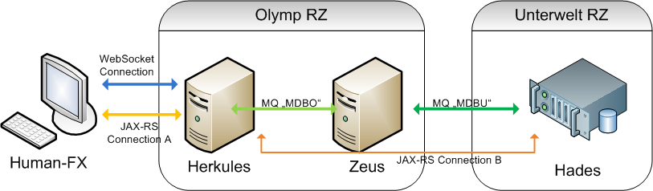

# Neue Infrastruktur Sage

Ziel soll zeigen, wie eine moderne Infrastruktur aussehen könnte, denn HTTP WebServices sind synchron, niemals <b>asynchron</b> und der Einsatz von einem ständigen Polling scheint im Hinblick auf die aktuelle Last und Laufzeiten wenig sinnvoll, wenn es denn überhaupt sinnvoll sein könnte.

## Technologie
Die genutzten Technologien sind:
* JMS mit mehreren Queue, da das Pub/Sub nicht recht wollte, mit Liberty.
* WebSockets zur Benachrichtung, wenn erfolgreich
* JavaFX für den Test Client

## Namen

### Human-FX
Dies stellt den Client dar.
Gestartet wird die Anwendung ``mvn compile exec:java``

### Herkules-WAR
Einstieg in die Kommunikation und Kontakt zum Client:
* Stellt WebServlet zum Schicken einer MDB Nachricht bereit (zum Test)
* Stellt WebServlet zum StatusCheck bereit (zum Test)
* Stellt WebSocket bereit

### Zeus-WAR
Ist die erste nachgelagerte Komponente, nicht mehr menschlich. 
* Greift auf die Queue MDBO zu Annahme zu
* und gibt Nachricht an die Queue MDBU weiter

### Hades-WAR
Die Unterwelt, das nachgelagerte Backend.
* Greift auf die MDBU zur Annahme zu
* Setzt die Session-ID der WebSocketverbindung in Map
* Aktualisiert zu der den Status

Der Status einer SessionID kann sich über die RestSchnittstelle:
``http://localhost:9124/fantasy-hades-war/unterwelt/api/status/16``
abrufen lassen, hierbei ist ``16`` die aktuelle SessionID.

Achtung in der aktuellen Umsetzung, je Client nur eine WebSocket Session!

## Probleme

### Build von Human-FX schlägt fehl
In diesem Fall ist oft das ``fantasy-hermes-jar`` nicht erfolgreich gebaut und im Repo abgelegt. Das Gleiche kann auch mit dem ``fantasy-parent`` passieren.
Lösung: ``mvn clean package install``.
 
## Ablauf

* Es wird mit dem Start die aktuelle konfigurierte Client-ID ausgelesen und gesetzt
* Dann erfolgt eine Anmeldung am WebSocket Server (Herkules) mittels dieser ID.
    * Der WebSocket-Kanal wird dazu genutzt, dass Herkules später asynchron, nach erfolgreicher Verarbeitung den Client (Nutzer) über den Stand informieren kann.
    * Dieser Kanal könnte auch zum Austausch weiterer Meldungen genutzt werden.
* Zwischen dem Client (Human-FX) und Herkules werden mittels Jax-RS Verbindung die eigentlichen Datensätze ausgetauscht.
* Herkules tauscht mittels MessageQueue über MessageDrivenBean mit Zeus die Datensätze aus.
    * Zeus läuft dabei im gleichen Informationsverbund wie Herkules
    * Zeus ist der Weiterleiter, er besitzt keine weitere entscheidende Rolle
* Zeus leitet an den eigentlich Dienst Hades, wo die Verarbeitung stattfinden wird, den Datensatz ebenfalls mittels einer MessageQueue weiter.
    * Es wird mehr als eine Unterwelt und mehr als einen Hades geben, somit müssen entsprechende Queues definiert werden
* Hades hat dabei folgende Aufgaben:
    * Die Entgegennahme der Datensätze.
    * "Verarbeitung" der Datensätze
    * Verwaltung des Status der Verarbeitungen
    * Besitzt Schnittstelle, zum Abfragen über des Verarbeitungsstatus (Jax-RS), später würde sicherlich über Herkules oder Zeus eine Socket Verbindung sinnvoller sein.
* Herkules besitzt in der Dummy Umsetzung einen @EJBTimer der ein Polling des Verarbeitungsstatus jeder aktiven WebSocket Session über Hades anstößt. Bei Veränderung des Status informiert er den Client (Human-FX) per WebSocket Kanal.

